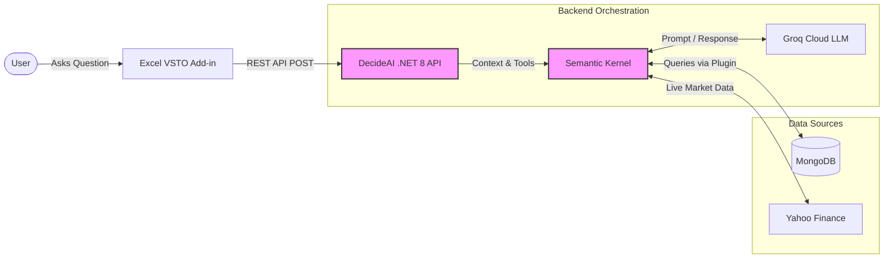
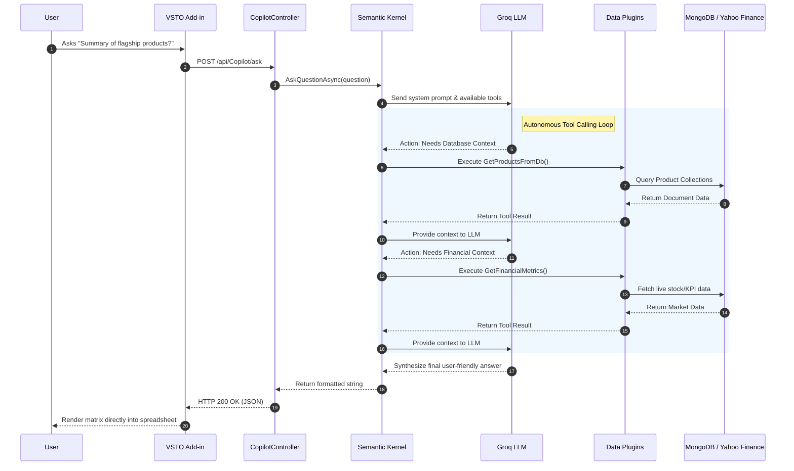

# DecideAI: Enterprise Portfolio Copilot

DecideAI is an AI-powered Enterprise Portfolio Copilot that integrates directly into spreadsheets via a VSTO Add-in. It allows product portfolio managers at hardware/semiconductor companies (e.g., Nexus Semiconductor) to query unstructured product specs, combine them with financial KPIs, and generate decision-ready reports using RAG and LLM Tool Calling.

## Tech Stack
* **Backend:** C# / .NET 8 Web API
* **Frontend:** VSTO / Office Interop (Excel Add-in)
* **Database:** MongoDB (NoSQL)
* **AI Orchestration:** Microsoft Semantic Kernel (Tool Calling & RAG)
* **LLM & Embeddings:** Ollama (Local LLMs - zero cost)
* **Testing:** xUnit & Moq
* **Deployment:** Docker & docker-compose

## Project Structure
* `DecideAI.API`: .NET 8 Web API containing Semantic Kernel orchestration and MongoDB integrations.
* `DecideAI.Core`: Shared domain models, interfaces, and DTOs.
* `DecideAI.Tests`: xUnit test suite with Moq for testing services.
* `DecideAI.AddIn`: VSTO Excel Add-in project (C#).
* `docker-compose.yml`: Local infrastructure setup (MongoDB, Ollama).

## Getting Started

### Prerequisites
* [.NET 8 SDK](https://dotnet.microsoft.com/en-us/download/dotnet/8.0)
* [Docker Desktop](https://www.docker.com/products/docker-desktop)
* Visual Studio (Windows) for the VSTO Add-In development.

### Running Local Infrastructure
1. Start MongoDB and Ollama using Docker:
   ```bash
   docker-compose up -d
   ```
2. Pull the local LLM model (e.g., phi3 or llama3):
   ```bash
   docker exec -it decideai_ollama ollama pull phi3
   docker exec -it decideai_ollama ollama pull nomic-embed-text
   ```

### Running the API
```bash
cd DecideAI.API
dotnet run
```

### Developing the VSTO Add-In
* Open the solution in Visual Studio on Windows.
* Ensure the "Office/SharePoint development" workload is installed.
* Build and run the `DecideAI.AddIn` project to launch Excel with the Copilot side-pane.

## Architecture Design

### High-Level Architecture
This diagram illustrates the macro-level flow of data from the user interface down to the cloud models and data stores.



### Detailed Execution Flow (Sequence Diagram)
This diagram illustrates the step-by-step Tool Calling (Auto-Invoke) process handled by Microsoft Semantic Kernel.


